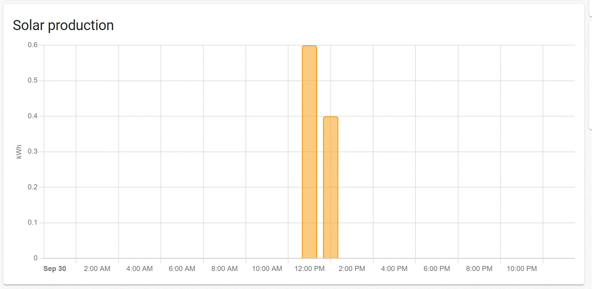

[](https://github.com/hacs/integration)

# Solis sensor integration
HomeAssistant sensor for Solis portal platform V2 (m.ginlong.com) and SolisCloud portal. 
Still questions after the readme? Read the [wiki](https://github.com/hultenvp/solis-sensor/wiki) or look at the [discussions page](https://github.com/hultenvp/solis-sensor/discussions)

## Platform v2
The platform v2 support logs in to the platform and exposes the data retrieved as sensors.
Also confirmed to work with:
* Solarman (home.solarman.cn)
* Sofar solar (home.solarman.cn)

> Platform V2 backend is used by Ginlong and MyEvolveCloud and the same backend is also used for different PV inverter brand portals. I've only tested it in context of Solis with the Ginlong platform. Let me know if it works with for other inverter types as well and I'll add them to the list of confirmed portals.

## SolisCloud
>❗This feature is in beta. The server still has some issues, see [known limitations](#warning--known-limitations) section. Join the discussion [here](https://github.com/hultenvp/solis-sensor/discussions/71) to find out about known limitations and to ask questions.

[SolisCloud](https://www.soliscloud.com/) is the next generation Portal for Solis branded PV systems from Ginlong. It's unknown to me if the other brands are also supported.

The new portal requires a key-id, secret and username to function.
You can obtain key and secret via SolisCloud.
* Submit a [service ticket](https://solis-service.solisinverters.com/support/solutions/articles/44002212561-api-access-soliscloud) and wait till it is resolved.
* Go to https://www.soliscloud.com/#/apiManage.
* Activate API management and agree with the usage conditions.
* After activation, click on view key tot get a pop-up window asking for the verification code.
* First click on "Verification code" after which you get an image with 2 puzzle pieces, which you need to overlap each other using the slider below.
* After that, you will receive an email with the verification code you need to enter (within 60 seconds).
* Once confirmed, you get the API ID, secret and API URL

## HACS installation

The use of HACS is supported and is the preferred means of installing this integration.

## Manual installation

Create a directory called `solis` in the `<config directory>/custom_components/` directory on your Home Assistant instance.
Install this component by copying the files in [`/custom_components/solis/`]

This is how your custom_components directory should be:
```bash
custom_components
├── solis
│   ├── __init__.py
│   ├── config_flow.py
│   ├── const.py
│   ├── ginlong_api.py
│   ├── ginlong_base.py
│   ├── ginlong_const.py
│   ├── manifest.json
│   ├── sensor.py
│   ├── service.py
│   ├── soliscloud_api.py
│   ├── soliscloud_const.py
│   ├── strings.json
│   └── workarounds.yaml
```

### :warning:  Known limitations

#### Obtaining API access
As of 27/9/2022 Ginlong had suspended access to the Soliscloud API claiming GDPR issues. From Oct 26 the [access has been restored](https://solis-service.solisinverters.com/support/solutions/articles/44002212561-api-access-soliscloud).
All should be fine again, but be aware the API is still under active development and unpredictable events may occur.

#### HTTP 408 Error
Not a real limitation, but a feature of the API. It caused by differences of more than 15 minutes between your local time and server time. This can happen when you run HA in a VM. ***Update your local time.***

#### Server timeouts
Just wait, they'll pass. Sometimes minutes, sometimes longer. This can be frustrating however if it happens during configuration.

#### The Chinese error message that translates into "Abnormal data"
Make sure debug is ON and make confirm you get an error messsage with Chinese text: [custom_components.solis.soliscloud_api] {'Success': True, 'Message': 'OK', 'StatusCode': 200, 'Content': {'success': True, 'code': '1', 'msg': '数据异常 请联系管理员', 'data': None}}. 
  * Alternatively copy all files from the [/test folder](https://github.com/hultenvp/solis-sensor/tree/master/test) to a local machine and make sure you have python 3 installed. Edit apitest_async.py, add your key/secret and run the test app with ```python apitest_async.py```. This test will call most API endpoints and return if the call was successful or not. You'll get the same Chinese error message if you have the "Abnormal data" problem.

Users have reported the following options as possible solutions:
* File a ticket with Solis, to solve the issue. Be prepared to wait. Can take weeks
* Deactivating (disable) the API administration in soliscloud.com and reactivating the API

***Results may vary. Do not create new tickets for this issue, it is a server error and Solis servicedesk needs to fix it for you!***

## Configuration

The integration can be configured via the UI.
* Go to Settings -> Devices and Services -> Click Add integration and select "Solis"
* Select the right platform and platform URL to use and click "Submit"
* If you add multiple configurations, make sure all of them have a unique name.


**Ginlong platform v2**   
* Provide username, password and plant id. If you want to add multiple plants just repeat "add integration" for each plant.

**Soliscloud**            
* Provide username, key id, secret and station id. If you want to add multiple plants just repeat "add integration" for each plant.
* To get StationId: 
  1. Log in to SolisCoud.com
  2. In the Plant Overview tab, under the Plant Name column, Click on your actual plant name, per the screenshot below:
  
  
  3. Copy the 19-digit number from the URL: https://www.soliscloud.com/#/station/stationdetail_1?id=XXXXXXXXXXXXXXXXXXX and paste it in the station ID field:
  


# Energy dashboard
The Solis integration now supports the energy dashboard introduced in Release 2021.8. 
> Note: This integration requires Home Assistant version 2021.9 or higher




# Thanks
Big thanks & kudo's to [@LucidityCrash](https://github.com/LucidityCrash) for all the work on getting the SolisCloud support working!
